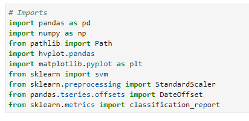
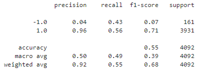
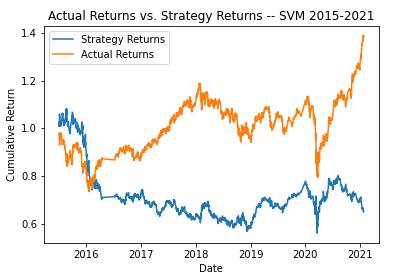
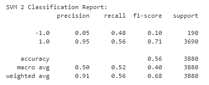
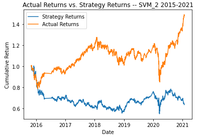
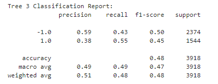
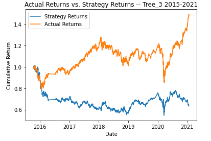

# fintech_challenge_14
This notebook creates an agorithmic trading bot that can learn and adapt to new data and evolving markets. Then we tune parameters to optomize the model, and finally we train
a new ML model and compare performances. Below, you will find an analysis of each model and comparison of all the results.

---
## Technologies
This program utilizes Jupyter Lab with the following libraries:

---
## Summary
To begin, we will analyze the initial baseline model's performance. For this model we will use SKLearn's support vector machine. 
Here is the classification report: 
We can see that the model seems to be fairly lopsided in its predictions, it obviously prefers +1 over -1. This is because the dataset we fed our model was very imbalanced
with many more +1 signals than -1 signals (Counts in dataset: 1.0 = 2368, -1.0 = 1855). Here is a visualization of the original model's actual vs. strategy cumulative return: 

Next, we will use SKLearn's support vector machine once again. This time we will attempt to optomize the model by tuning the size of the training dataset and the SMA input 
features. Here is the classification report for the optomized model: 
The report shows us that the precision for +1 and -1 both rose by 0.01. The -1 recall gained 0.05 while +1 remained the same. The -1 f1-score increased by .03 while the +1 
remained the same. Overall, this report shows us that our optomized model gained a bit more precision and recall for -1 while maintaining the same values for +1.
The overall accuracy increased by 0.01

Here is a visualization of the optomized model's actual vs. strategy cumulative return:

The optomizations made to the model are as followed:
	* DateOffset to 5 rather than 3
	* Short window to 6 rather than 4
	* Long window to 180 rather than 100

What impact resulted from increasing or decreasing the training window?: When tuning the training window, I noticed that the model's accuracy suffered if I increase the
training window while maintaining the same SMA long-window value. After some testing I decided to go with a DateOffset of 5 months, this meant that I needed larger SMA 
long-window than what was used in the original model. Overall I think increasing the training window allows us to create a slightly more optomized model.

What impact resulted from increasing or decreasing either or both of the SMA windows?: When tuning the SMA windows I noticed that the ratio between the short and long windows
is very important. In general I found increasing or decreasing them together gave me semi-consistent patterns to follow.  
A very large long window with a very small short window was causing my model accuracy issues. I also noticed that larger training windows benefitted
from larger short and long windows.

Finally, we will use SKLearn's DecisionTreeClassifier to create a new model with a new ML classifier. Here is the classification report for the new model: 

Comparing this report to the original model report shows us that the overall accuracy dropped by 0.07. The -1 precision rises by 0.56 while +1 decreases by 0.60. The -1 recall
gains 0.01 while +1 decreases by 0.01. The -1 f1-score increases by 0.43 and the +1 decreases by 0.25. Overall, this shows us that the new model really improved on the -1
precisionbut at the sacrifice of too much of +1's precision. The optomized model is very similar to the original with slightly higher numbers, so it is redundent to reiterate
the differences.
Here is a visualization of the new model's actual vs. strategy cumulative return:

Did this new model perform better or worse than the provided baseline model?: This new model performed quite a bit worse. The new model did a great job with -1 precission
but it sacrified too much +1 precission, therefore the new model overall had a lower accuracy than the original model.

Did this new model perform better or worse than your tuned trading algorithm?: The new model also performed worse than the optomized model. The optomized model outperforms
the original model so it makes sense that the new model performed worse in comparison. The new model had an increased -1 precission but just as in the previous answer,
it simply lost too much overall accuracy to compete with the optomized model

---
# Evaluation Report
Overall, this notebook contains three different ML models. The original and optomized models both use SKLearn's support vector machine while the third model
uses a new ML classifer DecisionTreeClassifier. The optomized model simply builds on top of the original, when comparing classification reports we can see that they are very
similar with the optomized model having just a bit more overall accuracy. The third model utilizes an entirely different classifier, for this model the parameters were set
a bit more dramatically with an overall larger training set and SMA windows set with no real ratio in mind. Overall the third model performs much worse compared to either the
original or optomized model. This means that the second model, the optomized model, is the most accurate model in this notebook.
Here are all the classification reports and visualizations for all the models:

---
## Contributors
Kevin Gross

---
## License
This program is covered under the MIT license.